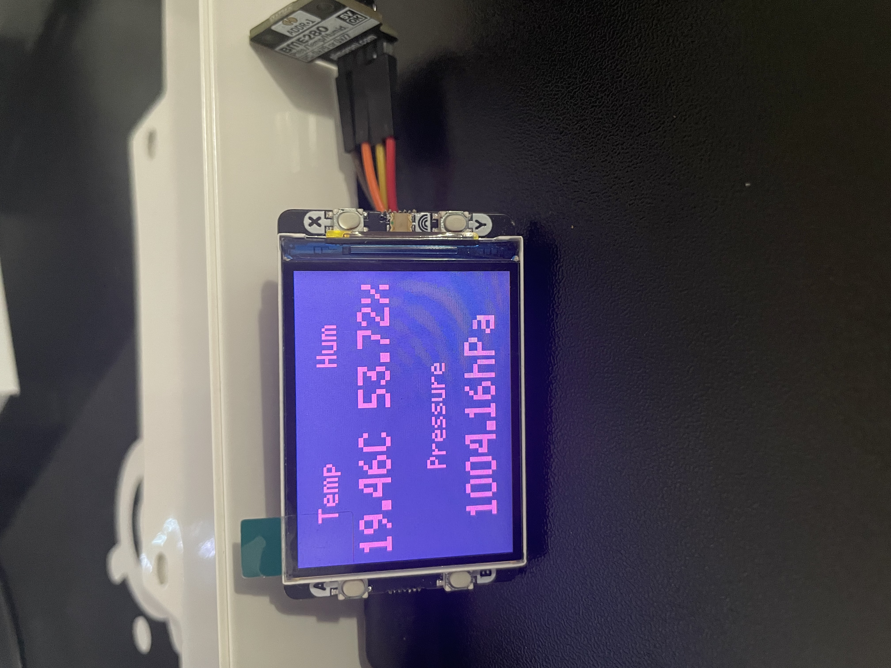
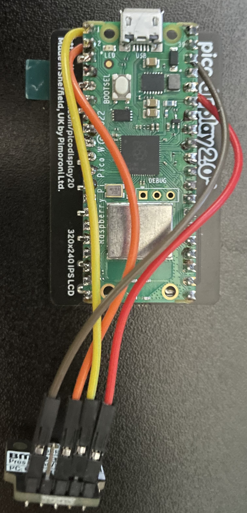

# A Pi Pico W Environment Monitor with Some Added Fun
A normal environment monitor is boring, so this one lets you play games and get inspiring quotes from ChatGPT. 
## Hardware Used 
This utilizes a pi pico w, the BME 280 environment sensor, along with the pico display pack 2.0. This project will require some simple soldering to attach the header pins. 
## Software
I used Thonny IDE to write and upload the uPython code. The code is seperated in to blocks with comments so it should be easy to grasp its organization.
## Final Product 
Once everything is soldered together and the code is placed on the pi pico w then you have a fully working fun environment monitor. Use the buttons to navigate throught the menu and explore all the cool features this *very practical* environment monitor has. 
 
 
## Current Bugs
There is an issue where after a set amount of time the temperature stops updating and everything freezes. I had fixed this, however, the SSD I had done this one as well as a few other projects was stolen along with other stuff so the solution is lost. I will look into it when I have a break from school to get it all back up and running.
